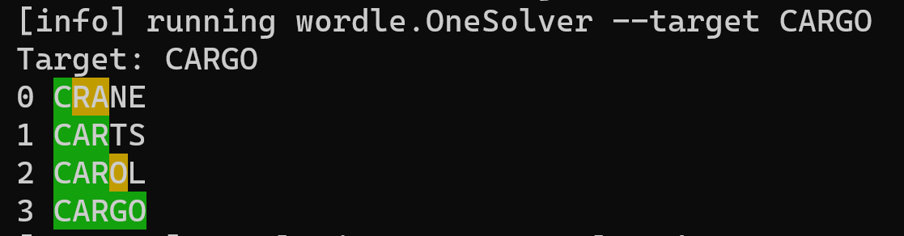

# Wordle Solver
A solver for the game [Wordle](https://www.nytimes.com/games/wordle/index.html).  Has no affiliation with Wordle or the NY Times.  This is just a bit of fun to practice writing some AI.

## Running
Install the [Scala Build Tool (SBT)](https://www.scala-sbt.org/).  One way to fetch it is to install [sdkman](https://sdkman.io/) and then:
```
sdk install sbt
```

To see how it solves a particular word like "CARGO", run with:
```
sbt "run --target CARGO"
```
You'll see output similar to this (though it may choose a different starting word, changing the exact words used):


Try today's Wordle solution and see if you can beat the computer..

If run without arguments (`sbt run`) it will pick and solve a random word. 
